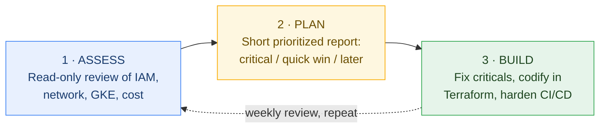
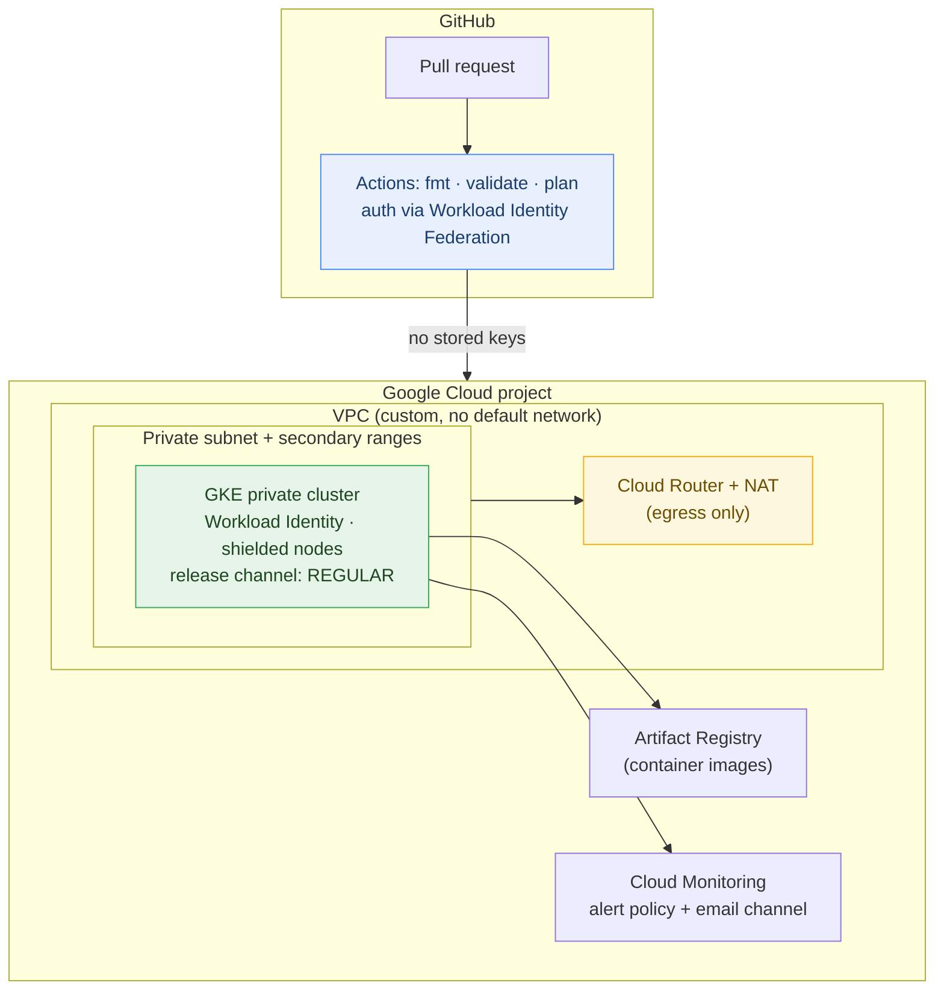

<div align="center">

# GCP DevOps Readiness Kit

**A working snapshot of how we assess, plan, and run Google Cloud infrastructure.**

Built by **CrewNexa** · Cloud Infrastructure & DevOps


</div>

---

## What this is

This repository is not a portfolio. It is a small, honest sample of the actual work:

1. **`scripts/gcp-assess.sh`** : a **read-only** assessment script. Run it against any GCP project and it prints a security, hygiene, and cost report in about a minute. It changes nothing.
2. **`terraform/`** : a production-shaped starter for a **private GKE cluster** with Workload Identity, Cloud NAT, Artifact Registry, and a monitoring alert. Small enough to read in ten minutes, structured the way real environments should be.
3. **`.github/workflows/`** : a CI pipeline that validates and plans Terraform using **Workload Identity Federation**. No service account keys stored in GitHub.
4. **`docs/first-week-plan.md`** : exactly what the first week of an engagement looks like, day by day, including the communication cadence.

> [!TIP]
> **Fastest way to evaluate us:** clone this repo, run the script against a sandbox project, and read the Terraform. Fifteen minutes tells you more than any resume.

---

## How we work

Every engagement follows the same three moves. Nothing exotic, just applied consistently:



The point of the loop: **you always know what state the infrastructure is in, what changes next, and why.** Every change lands through code review and CI, never by hand in the console.

---

## Quickstart: run the assessment

Requirements: `gcloud` CLI authenticated with **Viewer** level access. The script only calls `list` and `describe` operations. Cloud Shell works with zero setup.

```bash
git clone <this-repo>
cd gcp-devops-readiness-kit
chmod +x scripts/gcp-assess.sh
./scripts/gcp-assess.sh YOUR_PROJECT_ID
```

### What it checks

| # | Check | Why it matters |
|---|-------|----------------|
| 1 | Primitive IAM roles (`owner` / `editor`) | Broad roles are the most common breach amplifier |
| 2 | User-managed service account keys and their age | Old keys are standing credentials waiting to leak |
| 3 | Default compute service account usage | Ships with `editor` on classic setups |
| 4 | Firewall rules open to `0.0.0.0/0` on SSH / RDP / all ports | The classic front door left open |
| 5 | Publicly accessible storage buckets | `allUsers` bindings on buckets |
| 6 | Uniform bucket-level access | Prevents per-object ACL drift |
| 7 | GKE posture: private nodes, Workload Identity, release channel | The difference between a demo cluster and a production one |
| 8 | VMs with public IPs | Attack surface and often unnecessary |
| 9 | OS Login at project level | Centralized SSH, auditable access |
| 10 | Unattached persistent disks | Pure cost leak |
| 11 | Reserved but unused static IPs | Small, silent monthly waste |
| 12 | Logging and Monitoring APIs enabled | You cannot run what you cannot see |

Output is color-coded in the terminal: green for healthy, yellow for review, red for act now. A summary with counts prints at the end.

> [!NOTE]
> The script is deliberately conservative. It never mutates state, never enables APIs, and degrades gracefully when a permission is missing. Read it before you run it; it is short on purpose.

---

## The Terraform starter



Design decisions baked in, so they never need to be retrofitted:

- **Private nodes, no public endpoints on workloads.** Egress through Cloud NAT only.
- **Workload Identity everywhere.** Pods get GCP access without service account keys.
- **Release channel `REGULAR` + maintenance window.** Upgrades are boring and predictable.
- **Deletion protection on the cluster.** One flag, one avoided disaster.
- **Everything is a variable.** Same module set promotes cleanly from staging to production.

```bash
cd terraform
terraform init
terraform plan -var="project_id=YOUR_PROJECT_ID" -var="alert_email=you@example.com"
```

---

## Repository layout

```
.
├── scripts/
│   └── gcp-assess.sh          # read-only assessment, 12 checks
├── terraform/
│   ├── versions.tf            # pinned providers
│   ├── variables.tf
│   ├── network.tf             # VPC, subnet, router, NAT
│   ├── gke.tf                 # private cluster + node pool
│   ├── registry.tf            # Artifact Registry
│   ├── monitoring.tf          # alert policy + channel
│   └── outputs.tf
├── .github/workflows/
│   └── terraform-ci.yml       # fmt, validate, plan (keyless auth)
└── docs/
    └── first-week-plan.md     # day-by-day first week + comms cadence
```

---

## Working with us

Two commitments that do not depend on mood, workload, or timezone:

- **A short written update every working day.** What moved, what is blocked, what is next. If nothing moved, the update says so.
- **Response within 4 business hours** on anything marked urgent, usually much faster. Our working hours overlap most of the European business day.

> [!IMPORTANT]
> Infrastructure work fails on silence more often than on skill. We treat communication as part of the deliverable, not a courtesy.

---

<div align="center">

**CrewNexa** · we design, build, and quietly run cloud infrastructure so your team can ship.

*This kit is illustrative and intentionally compact. Production engagements start with the assessment, not with assumptions.*

</div>
